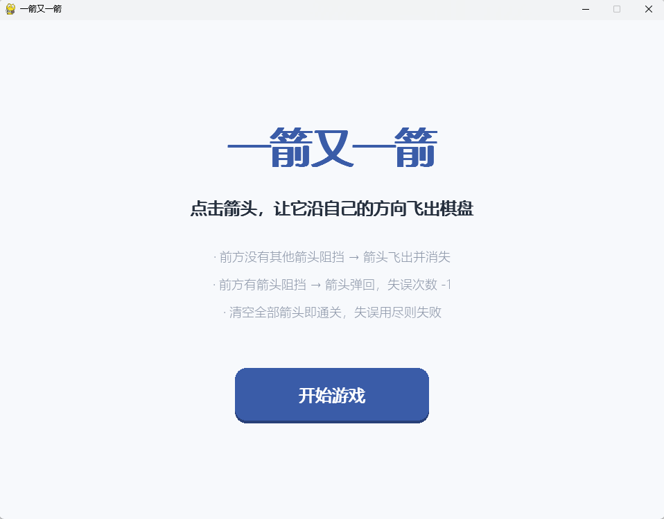
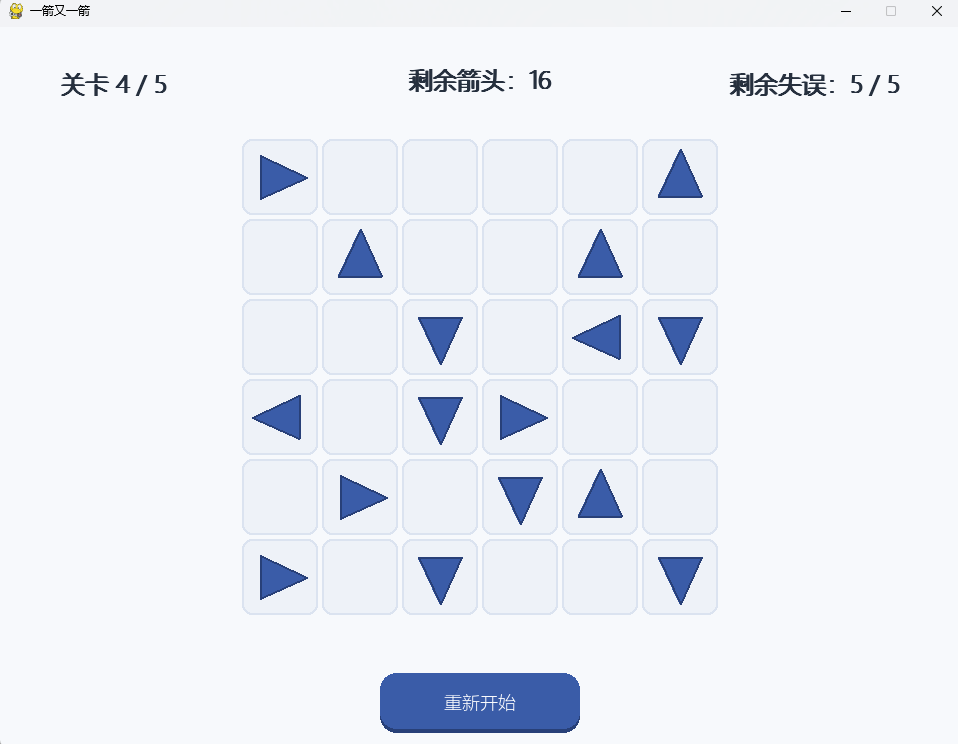
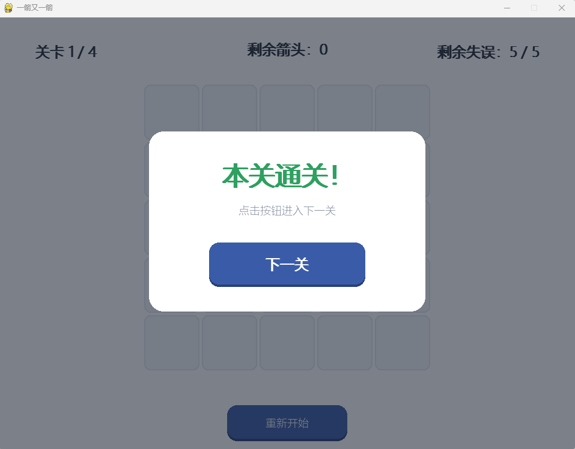
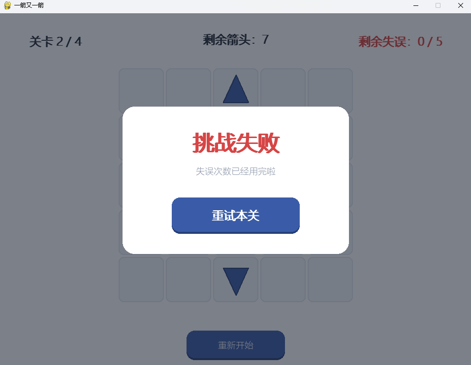

# 一箭又一箭（Arrow-Arrow）

## 项目名称
一箭又一箭 —— 基于 Pygame 的点击式箭头解谜小游戏

## 游戏简介
《一箭又一箭》是一款休闲解谜小游戏。棋盘上放置若干带方向的箭头（上、下、左、右），玩家点击箭头后，程序会沿箭头方向检测路径：
- 若前方没有其他箭头阻挡，箭头飞出棋盘并消失；
- 若前方有其他箭头阻挡，箭头弹回并抖动，失误次数 -1。
- 清空本关全部箭头即可通关，失误次数耗尽则本关失败。游戏包含多个可通关关卡，支持重新开始、关卡切换和动画反馈。

## 开发环境
- 操作系统：Windows 11
- Python 版本：3.8
- 图形库：Pygame 2.0
- 开发工具：PyCharm / VS Code / 命令行
- AIGC 辅助：DeepSeek

## 安装和运行方法
1. 安装 Python 3.8+
2. 安装 Pygame：
   ```bash
   pip install pygame
   ```
3. 进入项目目录，运行：
   ```bash
   python game.py
   ```

## 游戏操作说明
- 鼠标左键点击箭头：尝试让箭头飞出。若前方无阻挡，箭头飞出并消失；若前方有阻挡，箭头变红抖动，可失误次数 -1。
- 点击“重新开始”按钮：当前关卡恢复初始状态，失误次数重置。
- Esc：退出游戏
- 鼠标悬停：箭头所在格子高亮显示。

## 游戏截图
- 游戏开始界面:


- 某一关卡界面:


- 游戏成功通关界面:


- 游戏失败界面:

